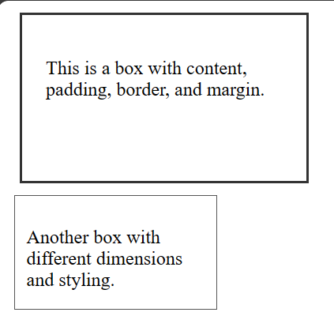

# Lecture Review Answers

## 1. Explain using code examples what is meant by props and state in React JS?

### Props (Properties)

Props are used to pass data from a parent component to a child component. They are immutable, meaning that the child component cannot modify the props it receives. Props allow you to create dynamic and reusable components by passing different data to the same component.

```
// ParentComponent
import React from 'react';
import ChildComponent from './ChildComponent';

const ParentComponent = () => {
  const message = 'Hello from ParentComponent!';

  return (
    <div>
      <ChildComponent message={message} />
    </div>
  );
};

// ChildComponent
import React from 'react';

const ChildComponent = (props) => {
  return (
    <div>
      <p>{props.message}</p>
    </div>
  );
};

export default ChildComponent;
```

In this example, ParentComponent passes the message prop to ChildComponent, which then displays it. Props are accessed using the props object inside the child component.

### State

State is used to manage the internal state of a component. Unlike props, state can be changed by the component itself, and when the state changes, the component re-renders. State is initialized in the constructor of a class component or using the useState hook in a functional component.

```
// FunctionalComponent
import React, { useState } from 'react';

const FunctionalComponent = () => {
  const [count, setCount] = useState(0);

  const incrementCount = () => {
    setCount(count + 1);
  };

  return (
    <div>
      <p>Count: {count}</p>
      <button onClick={incrementCount}>Increment</button>
    </div>
  );
};

export default FunctionalComponent;
```

In this functional component example, the useState hook is used to initialize and update the state. Clicking the "Increment" button updates the state, triggering a re-render of the component.

## 2. In functional programming, what does the term functor mean? Can you give an example in JavaScript?

In functional programming, a functor is an object or data structure that implements the `map` function, providing a way to apply a function to the values inside it while preserving its structure. Functors allow you to perform operations on values within a context (such as a container or data structure) without changing the structure itself.

In JavaScript, arrays are a common example of functors. The map function is available on arrays and can be used to apply a function to each element of the array, creating a new array with the results.

```
// Define a functor (array)
const numbers = [1, 2, 3, 4, 5];

// Define a function to be applied to each element
const square = (x) => x * x;

// Use the map function to apply the function to each element of the array
const squaredNumbers = numbers.map(square);

console.log(squaredNumbers); // Output: [1, 4, 9, 16, 25]
```

In this example, `numbers` is a functor (an array), and the `map` function is used to apply the `square` function to each element of the array. The result is a new array `squaredNumbers` with the squared values.

## 3. We have looked at three kinds of asynchronous programming mechanisms, namely callbacks, promises and streams. Mention one advantage and one disadvantage of each type.

### Callbacks

#### Advantage:

- **Simple and Widely Supported:** Callbacks are a fundamental and widely supported asynchronous mechanism in JavaScript. They are easy to understand and use, making them accessible for developers, especially in scenarios with simpler asynchronous operations.

#### Disadvantage:

- **Callback Hell (Callback Pyramids):** One major disadvantage is the potential for callback hell, where multiple nested callbacks lead to code that is hard to read and maintain. This issue is also known as the "pyramid of doom" or "callback hell."

### Promises

#### Advantage:

- **Chaining and Error Handling:** Promises provide a cleaner way to handle asynchronous operations and help avoid callback hell by enabling method chaining. They also have built-in error handling through the `.catch` method, making it easier to manage errors in asynchronous code.

#### Disadvantage:

- **Unidirectional:** Promises have unidirectional behavior, meaning that a promise can be resolved or rejected only once. If you need to represent multiple values over time, promises might not be the most suitable mechanism. It can break badly when logical ordering of responses is required.

### Streams

#### Advantage:

- **Efficient Handling of Large Data Sets:** Streams are particularly useful for handling large data sets or streams of data in a memory-efficient way. They allow you to process data in chunks, which can be more efficient than loading an entire data set into memory.

#### Disadvantage:

- **Learning Curve:** Streams can have a steeper learning curve compared to callbacks and promises. Understanding concepts like backpressure, readable and writable streams, and the various stream-related events can be challenging for newcomers.

## 4. With the aid of a diagram and example code, describe the Cascading Style Sheets (CSS) Box Model and show how it can be used to space DOM elements

The CSS Box Model is a fundamental concept that describes the layout of HTML elements on a web page. It consists of content, padding, border, and margin, forming a box around every element.

### Components of the Box Model:

1. **Content:** The actual content of the box, such as text, images, or other media.

2. **Padding:** The space between the content and the border. It adds internal space within the box.

3. **Border:** A border surrounding the padding. It separates the padding from the margin and provides a visual boundary.

4. **Margin:** The space outside the border. It defines the clearance between the element's border and adjacent elements.

### Diagram:

```
+---------------------------------------------+
|             Margin (outermost)              |
|  +---------------------------------------+  |
|  |               Border                  |  |
|  |  +---------------------------------+  |  |
|  |  |            Padding              |  |  |
|  |  |  +-------------------------+    |  |  |
|  |  |  |         Content         |    |  |  |
|  |  |  |                         |    |  |  |
|  |  |  +-------------------------+    |  |  |
|  |  |                                 |  |  |
|  |  +---------------------------------+  |  |
|  |                                       |  |
|  +---------------------------------------+  |
|                                             |
+---------------------------------------------+
```

### Example:

```html
<!DOCTYPE html>
<html lang="en">
  <head>
    <meta charset="UTF-8" />
    <meta name="viewport" content="width=device-width, initial-scale=1.0" />
    <title>Box Model Example</title>
    <style>
      .box {
        width: 200px;
        height: 100px;
        border: 2px solid #333;
        padding: 20px;
        margin: 10px;
      }

      .box2 {
        width: 150px;
        height: 75px;
        border: 1px solid #555;
        padding: 10px;
        margin: 5px;
      }
    </style>
  </head>
  <body>
    <div class="box">
      <p>This is a box with content, padding, border, and margin.</p>
    </div>

    <div class="box2">
      <p>Another box with different dimensions and styling.</p>
    </div>
  </body>
</html>
```



## 5. Detail how the browser loads and bootstraps a rich web application from an initial URL

When a user enters an initial URL in a web browser, the process of loading and bootstrapping a rich web application involves several steps. Below is an overview of the typical sequence of events:

1. **User Input:** The user enters a URL in the browser's address bar and presses Enter.

2. **DNS Resolution:** The browser performs a Domain Name System (DNS) resolution to obtain the IP address of the domain.

3. **HTTP Request:** The browser initiates an HTTP request to the obtained IP address, specifying the path provided in the URL.

4. **Server Processing:** The server processes the request and returns an HTML document along with associated assets (CSS, JavaScript, images, etc.).

5. **HTML Parsing:** The browser parses the HTML document, constructing the Document Object Model (DOM) tree.

6. **CSS Parsing and Rendering:** As the DOM tree is being constructed, the browser encounters linked or embedded stylesheets. It parses and applies these styles to render the content.

7. **JavaScript Execution (Asynchronous):** While parsing the HTML, if the browser encounters script tags or linked JavaScript files, it starts downloading and executing them. Modern browsers often prioritize asynchronous loading to avoid blocking the rendering process.

8. **DOM Construction Continues:** Asynchronous JavaScript execution may modify the DOM, leading to incremental changes in the DOM tree.

9. **Rendering Tree Construction:** The browser combines the DOM tree and the CSSOM (CSS Object Model) to create the rendering tree, which represents the visual structure of the page.

10. **Layout:** The browser calculates the layout of each element in the rendering tree, determining their position and size on the screen.

11. **Painting:** The final step involves painting the pixels on the screen based on the calculated layout. This results in the visual representation of the web page.

12. **Event Handling and Interaction:** The browser sets up event listeners and enables user interactions. JavaScript handles user input and triggers events as needed.

13. **Continued Network Requests:** Depending on the application, additional resources like images or data may be loaded asynchronously.

14. **Application Initialization:** JavaScript code responsible for initializing the rich web application runs. This includes setting up state, managing user sessions, and potentially making additional API requests.

15. **User Interaction:** The user can now interact with the fully loaded and initialized rich web application.
